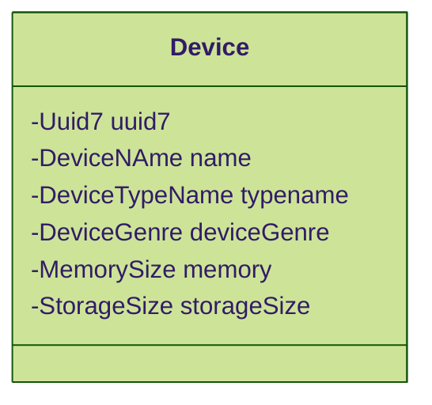

```mermaid
%%{init: {'theme': 'forest'}}%%
classDiagram
    class Device {
        -Uuid7 uuid7
        -DeviceNAme name
        -DeviceTypeName typename
        -DeviceGenre deviceGenre
        -MemorySize memory
        -StorageSize storageSize
    }

```