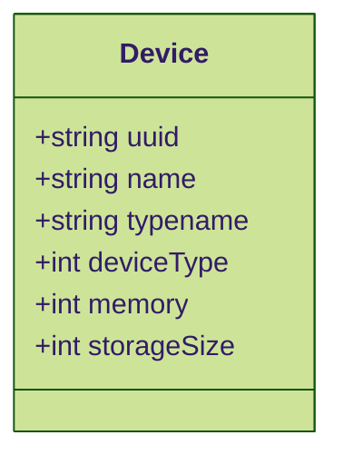

```mermaid
%%{init: {'theme': 'forest'}}%%
classDiagram
    class Device {
        +string uuid
        +string name
        +string typename
        +int deviceType
        +int memory
        +int storageSize
    }

```